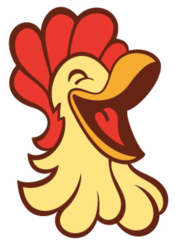

# ChequeIN

## The 10 golden rules of the Chicken
1. Do not talk about fight club
2. Create a new branch for every user story
3. Masta branch is solely used for production code
4. When an user story is done, make a pull request to `dev` branch
5. Every commit will be scrupulously validated by Lord Travis CI the Grey
6. A pull request will not be accepted unless 2 contributors approve
7. All hail to C#
8. Stay away from untyped javascript
9. Small people are the last ones to know it's raining
10. Java is to JavaScript as ham is to hamster - Jeremy Keith
